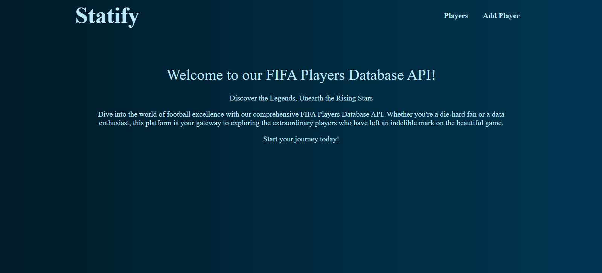
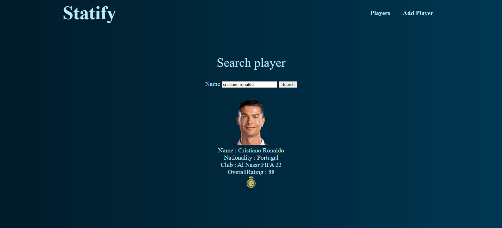
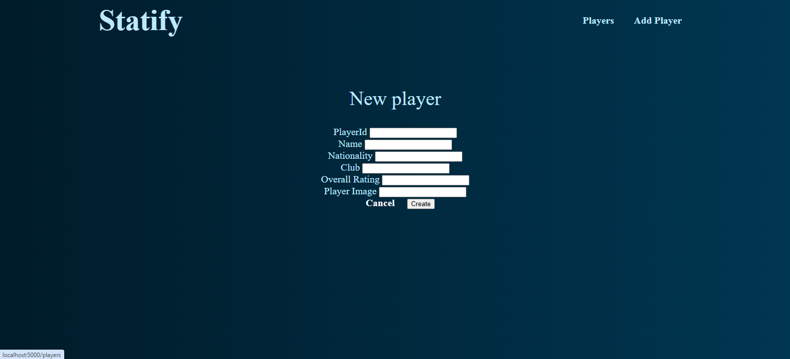

# FIFA Stats – MVC Node.js Application

This project was my first implementation of the **Model–View–Controller (MVC)** architecture using Node.js, Express, and MongoDB Atlas.  
It was also my first time working with **EJS templating**.

The goal of the project was to build a simple web application that displays and manages football player statistics stored in a MongoDB database.


## Features

- Display a list of players
- Search players by name
- Pagination system
- Add new players via form
- Data stored in MongoDB Atlas
- MVC architecture separation (Models / Views / Controllers)


## Tech Stack

- Node.js
- Express.js
- MongoDB Atlas
- Mongoose
- EJS
- express-ejs-layouts


## Architecture

The project follows the **MVC pattern**:

- **Models** → Mongoose schemas (`Player` model)  
- **Views** → EJS templates  
- **Controllers / Routes** → Express route handlers  
- **Database** → MongoDB Atlas cluster  

This project helped me understand:

- How to structure a Node.js backend properly  
- How routing connects to database logic  
- How server-side rendering works with EJS  
- How to connect and manage a cloud database


## Installation

```
git clone <your-repo-url>
cd fifaApp
npm install
npm run dev
```


## Setup

Create a `.env` file in the root directory with:

env
URI=your_mongodb_connection_string


## Screenshots

  
  
  


## What I Learned

- First experience with MVC architecture  
- First usage of EJS templating  
- Working with Mongoose models  
- Connecting to MongoDB Atlas  
- Handling asynchronous database operations  
- Debugging real production-like database issues


## Future Improvements

- Add authentication  
- Improve UI/UX  
- Add edit & delete functionality  
- Add validation middleware  
- Deploy on a cloud platform
